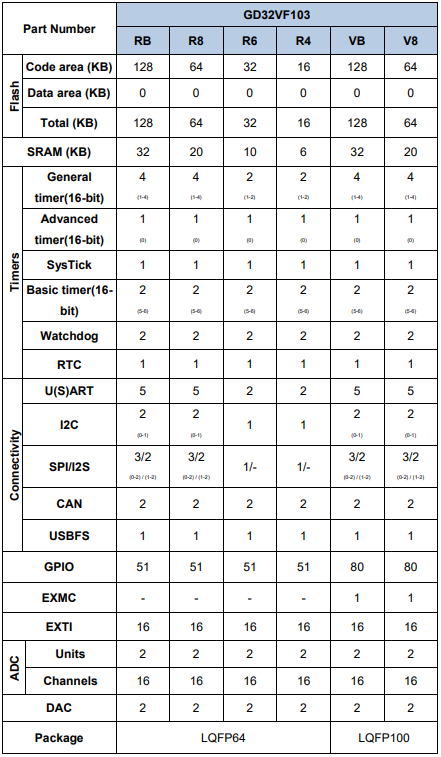

# [GD32V103](https://github.com/SoCXin/GD32V103)

* [GigaDevice](https://www.gigadevice.com/zh-hans)：[RISC-V Bumblebee](https://github.com/SoCXin/RISC-V)
* [L3R3](https://github.com/SoCXin/Level)：108 MHz (153DMIPS,360CoreMark)

## [简介](https://github.com/SoCXin/GD32V103/wiki)

[GD32V103](https://github.com/SoCXin/GD32V103) 集成芯来科技(Nuclei System Technology)的 Bumblebee内核，支持定制化指令，优化了中断处理机制，配备了64位宽的实时计时器、可以产生RISC-V标准定义的计时器中断，还支持数十个外部中断源，具有16个中断级别和优先级，并支持中断嵌套和快速向量中断处理机制。低功耗管理可以支持两级休眠模式。支持标准JTAG接口及RISC-V调试标准， 适用于硬件断点和交互式调试。Bumblebee内核也支持RISC-V标准的编译工具链，以及Linux/Windows图形化集成开发环境。

Bumblebee内核能够以二级流水线的代价，达到传统架构三级流水线的性能和频率，相比GD32 Cortex®-M3内核产品性能提升15%，动态功耗降低了50%，待机功耗更降低了25%。

### 关键特性

* 16CH 12bit ADC (2.6MSPS)，支持16-bit硬件过采样滤波功能和分辨率可配置功能

#### 封装规格

* QFN28 (4 x 4 x 0.85mm)
* QFN32 (5 x 5 x 0.85mm)

### [选型建议](https://github.com/SoCXin)

[GD32V103](https://github.com/SoCXin/GD32V103)

### [探索芯世界 www.SoC.xin](http://www.SoC.Xin)
