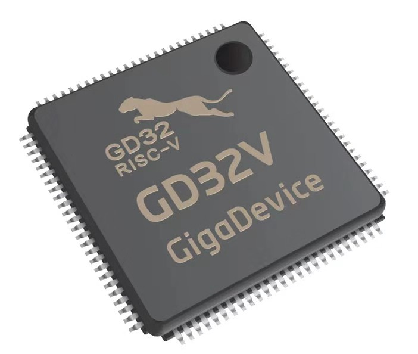

# [GD32VF103](https://github.com/sochub/GD32VF103) 

#### [Vendor](https://github.com/sochub/Vendor) ：[GigaDevice](https://github.com/sochub/GigaDevice)
#### [RISC-V](https://github.com/sochub/RISC-V) ：Bumblebee 
#### [Level](https://github.com/sochub/Level)：153DMIPS/108MHz

### [GD32VF103描述](https://github.com/sochub/GD32VF103/wiki) 

[GD32VF103](https://github.com/sochub/GD32VF103) 基于RISC-V的Bumblebee内核，支持RV32IMAC指令子集的组合，处理器频率108MHz，16~128KB的片上闪存和6~32KB的SRAM。

GD32VF103系列MCU在最高主频下的工作性能可达153 DMIPS，CoreMark®测试也取得了360分的优异表现，相比GD32 Cortex®-M3内核产品性能提升15%的同时，动态功耗降低了50%，待机功耗更降低了25%。

支持32比特宽的标准AHB-Lite系统总线接口，支持32比特宽的指令局部存储器。主流支持标准JTAG接口 和RISC-V调试标准。

### 关键参数：

* 108MHz 32位RISC-V处理器
* 12bit高精度ADC + DAC，ADC采样率高达2.6M SPS，多达16个可复用通道，支持16-bit硬件过采样滤波功能和分辨率可配置功能。
* USBFS/CAN/I2S/I2C/SPI，2.6V-3.6V供电，I/O口可承受5V电平

### [资源收录](https://github.com/sochub/GD32VF103)

* [文档](docs/) 
* [资源](src/) 
* [工程](project/) 

### [选型建议](https://github.com/sochub/GD32VF103)

###  [SoC资源平台](http://www.qitas.cn)   
